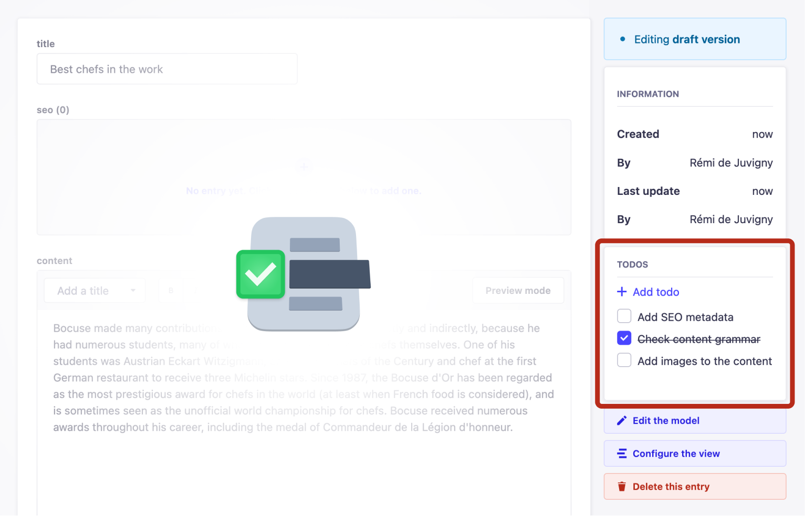

# strapi-plugin-todo


This plugin adds a todo list next to your content in Strapi. It makes it easy for admin users to keep track of their content management.



### Installation

Start by adding the plugin as dependency in your Strapi app:

```sh
# Using Yarn
yarn add @strapi-community/plugin-todo

# Or using npm
npm install @strapi-community/plugin-todo
```

Then build & restart your application:

```sh
# Using Yarn
yarn build && yarn develop

# Or using npm
npm run build && npm run develop
```

### Features & roadmap

- [x] Create a task
- [x] Toggle a task
- [ ] Delete a task
- [ ] Update a task
- [ ] Assign a task to a Strapi admin
- [ ] Set a due date for a task
